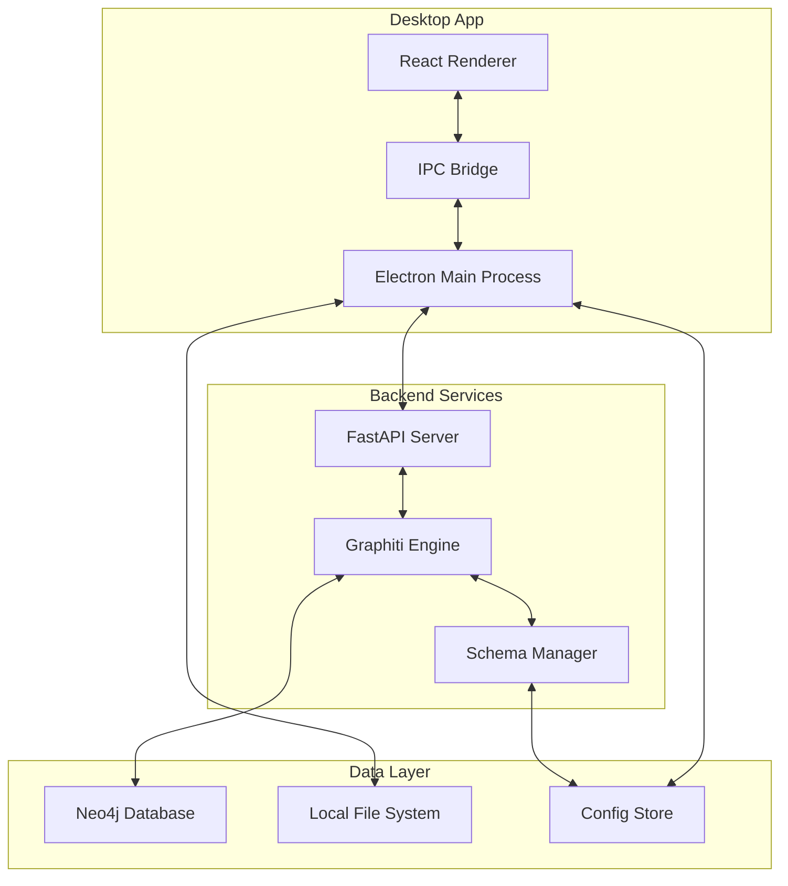

# JournalGraph Architecture Overview

Last Updated: 2025-01-20

## System Architecture

JournalGraph follows a modular architecture with clear separation between the desktop UI, business logic, and knowledge graph management.

## Core Components

### 1. Electron Desktop App
- **Main Process**: Handles file system access, window management, and native integrations
- **Renderer Process**: React-based UI with TypeScript
- **IPC Communication**: Secure bridge between main and renderer processes

### 2. Python Backend
- **FastAPI Server**: RESTful API for journal processing
- **Graphiti Integration**: Entity extraction and knowledge graph construction
- **Schema Manager**: Handles schema evolution and user customization

### 3. Data Management
- **Neo4j**: Graph database for storing knowledge graph (via Graphiti)
- **Local Storage**: User preferences, schema configurations
- **File System**: Direct access to Obsidian vault

## Data Flow

### Journal Import Flow
1. User selects journal folder in UI
2. Electron main process reads markdown files
3. Files sent to Python backend via API
4. Graphiti extracts entities and relationships
5. Schema Manager suggests/updates entity types
6. Data stored in Neo4j
7. UI updated with import results

### Daily Sync Flow
1. File watcher detects new/modified journal entries
2. Changed files queued for processing
3. Morning review UI presents extracted insights
4. User approves/modifies extractions
5. Approved changes committed to graph

### Query Flow
1. User enters natural language query
2. Query processed by backend
3. Graphiti searches knowledge graph
4. Results formatted and visualized
5. UI renders interactive graph/timeline

## Key Design Decisions

### Why Electron?
- Native file system access for Obsidian integration
- Familiar desktop app experience
- Cross-platform compatibility
- Rich UI capabilities with React

### Why Separate Python Backend?
- Best-in-class AI/ML libraries
- Graphiti is Python-native
- Clean separation of concerns
- Easier testing and scaling

### Why Neo4j?
- Graphiti's recommended database
- Excellent temporal query support
- Rich visualization capabilities
- Mature ecosystem

## Security Considerations

1. **Process Isolation**: Renderer process has no direct file access
2. **Input Validation**: All user inputs sanitized
3. **Local Processing**: No cloud dependencies, all data stays local
4. **Secure IPC**: Context isolation enabled in Electron

## Scalability

- **Incremental Processing**: Only process changed files
- **Lazy Loading**: Load graph data on demand
- **Background Processing**: Heavy operations in worker threads
- **Caching**: Query results and extracted entities cached

## Future Considerations

1. **Plugin System**: Allow custom entity extractors
2. **Multi-Vault Support**: Handle multiple Obsidian vaults
3. **Collaboration**: Shared knowledge graphs (opt-in)
4. **Mobile Companion**: iOS/Android viewers